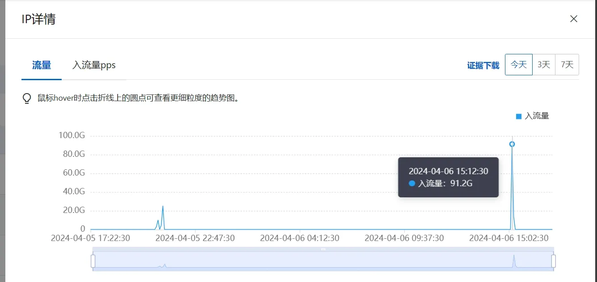
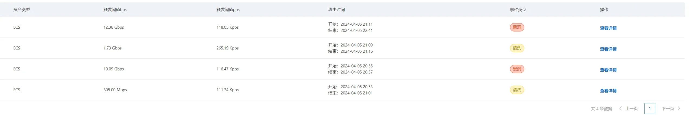
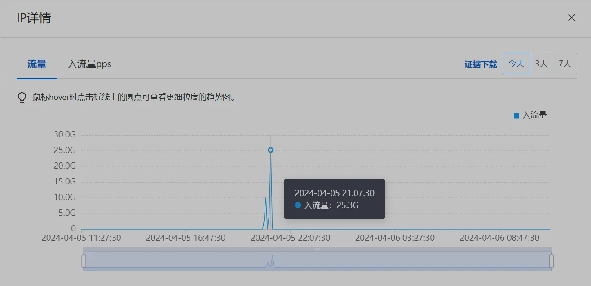
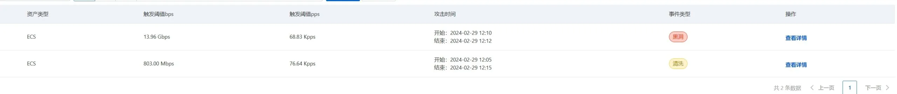
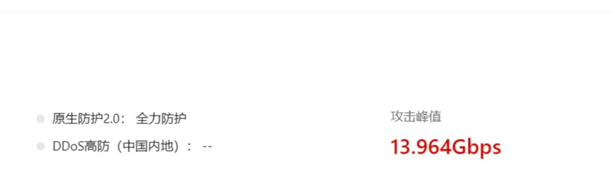

---
categories:
- 公告
cover: ./小本本-1.webp
date: 2024-04-06T11:56:59+08:00
draft: false
slug: ddos记录
tags:
- aliyun
- ddos
- udp
- 小黑屋
- 阿里云
title: DDoS记录
updated: 2025-12-17T19:19:02+08:00
wp_id: 8560
---

在华为云三年从来没被打过，来到阿里云三天两夜进小黑屋，很难怀疑有人帮阿里云安全部门冲业绩。

为以后吹牛留下证据，如今记录和备份一下被ddos的过程。

## 2024-04-08

01:23 入流量39.4G

## 2024-04-06

15:19 入流量91.2G

攻击峰值：102.501Gbps

## 2024-04-05

20:53 入流量10.1G

21:09 入流量25.3G

通过cap文件查阅，发现大部分都是通过UDP呼喊80端口，想必这也是ddos很难防御的原因。

## 2024-02-29

12 : 05 成功经历了第一次DDOS攻击！

攻击峰值：13.964Gbps

