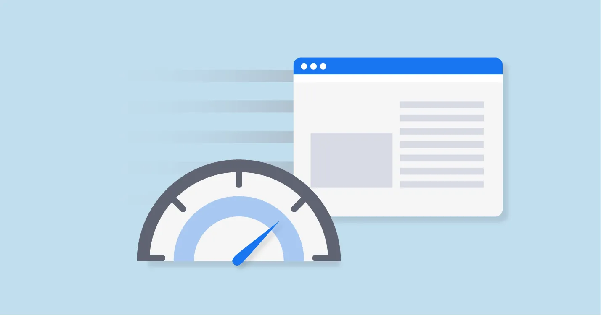
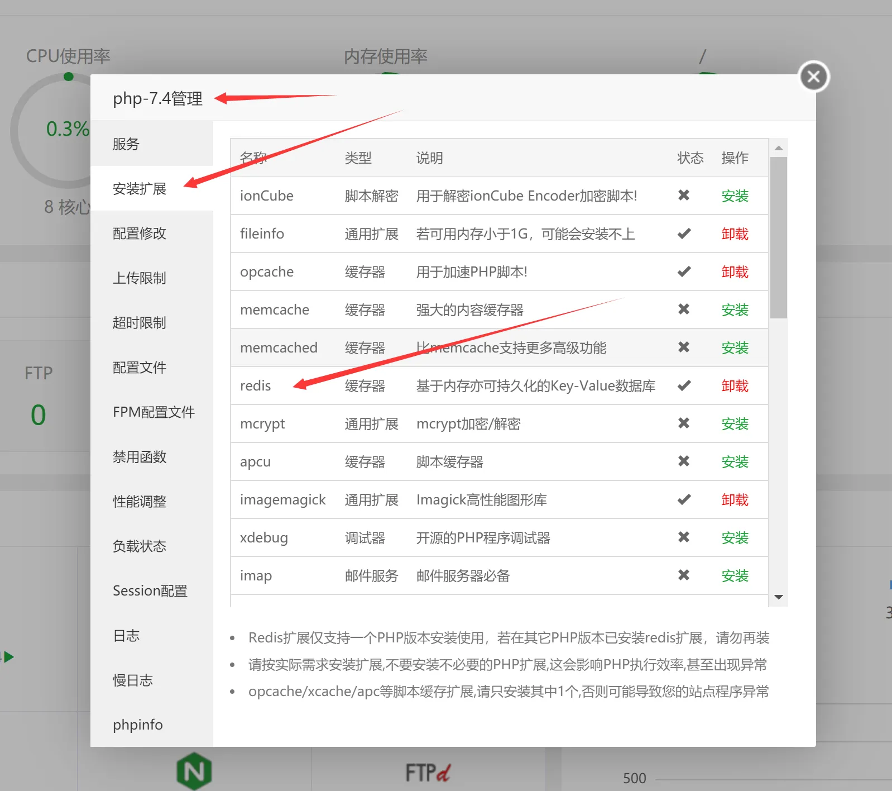
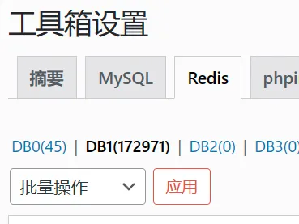
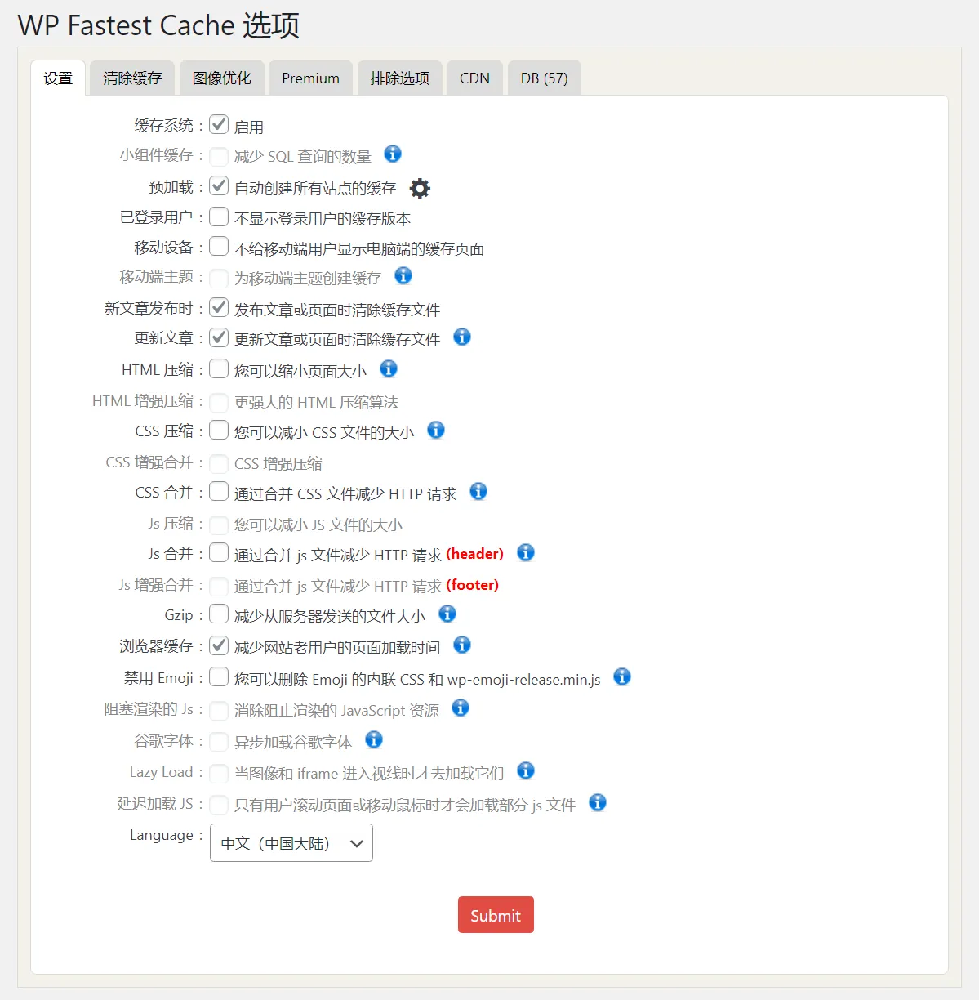
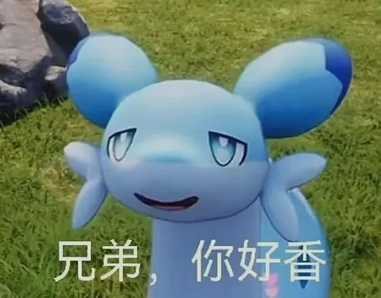

---
categories:
- PHP
- WordPress
- 信息技术
cover: https://www.krjojo.com/wp-content/uploads/2024/03/加速banner-1.webp
date: '2024-03-29T17:40:34+08:00'
draft: false
slug: wordpress完全性能优化指南-wordpress网站加速
tags:
- CDN
- opcache
- redis
- WordPress
- 优化
- 网站加速
- 页面缓存
title: Wordpress完全性能优化指南
updated: '2026-01-20T18:08:07+08:00'
wp_id: 8492
---



WordPress 是一个内容管理系统 (CMS)，可让您使用可视化工具构建网站。WordPress 有许多第三方开发的免费的模板和插件，安装方式简单易用，无限的扩展能力也让Wordpress能实现各种各样的效果，论坛，商城，社交，社区等等。

但是凡事皆有代价，无限的扩展能力所换来的是性能效率极其低下，面对同为 CMS 的Typecho、Z-Blog，Wordpress显得非常臃肿。

明白了Wordpress的性能上限，就可以在上限内设定优化目标了。

## 效果

先看效果

**阿里云 ECS 经济型e实例99计划 2核2G，3M固定带宽**

测试环境：

* openresty:1.21
* php:8.2
* redis:7.2
* mysql:8.2

使用docker部署

### [PageSpeed Insights](https://pagespeed.web.dev)

谷歌基准测试


### [itdog网站测速](https://www.itdog.cn/http/)

缓慢测试（大约三并发）


### 广州移动访问响应计时


## 数据库缓存

首当其冲就是数据库缓存了，php在执行函数最消耗时间的就是查询SQL数据库了，一般来讲一个页面的数据库查询大概在120到260次左右，使用Redis或者Memcached缓存，原理就是将php查询过的数据库缓存下来，下一次相同内容就不再查询数据库了，直接从缓存获取，极大的提高php执行效率。

> Redis 为什么这么快？
>
> Redis的操作都是基于内存的，CPU不是 Redis性能瓶颈,，Redis的瓶颈是机器内存和网络带宽。因为Redis的瓶颈不是cpu的运行速度，而往往是网络带宽和机器的内存大小。再说了，单线程切换开销小，容易实现既然单线程容易实现，而且CPU不会成为瓶颈，那就顺理成章地采用单线程的方案了

* 安装Redis程序
* 为PHP环境安装redis扩展（安装完成之后，记得重启一下php服务）
* 安装WP插件（**[Redis Object Cache](https://cn.wordpress.org/plugins/redis-cache/)**）
* 配置Redis链接，启用 **Redis Object Cache** 插件



配置Redis链接，在网站根目录中修改 wp-config.php 文件

在 `require_once ABSPATH . 'wp-settings.php';` 前添加以下内容。

```
define( 'WP_REDIS_HOST', 'redis' );
define( 'WP_REDIS_PORT', 6379 );
define( 'WP_REDIS_PASSWORD', 'zheshimima' );

define( 'WP_REDIS_PREFIX', 'k_' );
define( 'WP_REDIS_DATABASE', 1 ); // 0-15

define( 'WP_REDIS_TIMEOUT', 1 );
define( 'WP_REDIS_READ_TIMEOUT', 1 );
```

配置参数如下，具体参考**Redis Object Cache**文档：

<https://github.com/rhubarbgroup/redis-cache/#configuration>

| 配置常量 | 默认 | 描述 |
| --- | --- | --- |
| `WP_REDIS_HOST` | `127.0.0.1` | Redis 服务器的主机名 |
| `WP_REDIS_PORT` | `6379` | Redis 服务器的端口 |
| `WP_REDIS_SCHEME` | `tcp` | 用于连接的方案：或`tcp``unix` |
| `WP_REDIS_DATABASE` | `0` | 缓存使用的数据库：`0-15` |
| `WP_REDIS_PASSWORD` |  | Redis 服务器的密码，支持 Redis ACLs 数组：`['user', 'password']` |
| `WP_REDIS_TIMEOUT` | `1` | 连接超时（以秒为单位） |
| `WP_REDIS_READ_TIMEOUT` | `1` | 读取/写入时的超时（以秒为单位） |

注意，如果你使用的是1panel面板搭建的Redis容器，请跟我一样把HOST设置成"redis"。

最后进入插件设置，开启缓存



可以看到Redis成功缓存了17万条数据，从而节省大量SQL查询。

---

## OPcache

OPcache（Opcode Cache）是 PHP 的一个内置扩展，用于缓存 PHP 脚本的解释代码（opcode），从而提高 PHP 应用程序的性能。当 PHP 脚本首次被解释执行时，PHP 将脚本编译成一组中间代码（opcode），并在运行时执行这些 opcode。OPcache 的作用是缓存这些 opcode，避免在每次请求时都重新解释和执行相同的脚本。

同时，PHP 8 在PHP的内核中添加了 JIT 编译器，可以极大地提高性能。更强的cpu密集处理，或许以后php也可以适当做复杂协议解析。

为PHP环境安装 opcache 扩展

### 开启JIT

如果你使用的是PHP8及以上版本，请在PHP配置文件中加入以下代码来启用JIT。

打开 `php.ini`

寻找 [opcache] ，在 [opcache] 下方加入内容。如果没有则直接在最底部加入。

```
[opcache]
opcache.enable=1
opcache.enable_cli=1
opcache.memory_consumption=256
opcache.interned_strings_buffer=8
opcache.max_accelerated_files=10000
opcache.jit=1205
opcache.jit_buffer_size=128M
```

保存后重启PHP服务

刷新便能看到效果，负载肉眼可见的降低了

具体详细配置可以看我之前的文章，[PHP8 JIT 配置说明](https://www.krjojo.com/2024/01/09/php8-jit-%e9%85%8d%e7%bd%ae%e8%af%b4%e6%98%8e/)

---

## 页面缓存

为不会变化的页面建立缓存，避免每次访问页面都要从头执行PHP代码，这将能剩下非常多的执行时间。

安装**[WP Fastest Cache](https://cn.wordpress.org/plugins/wp-fastest-cache/)**插件。

启用缓存系统

使用预加载 - 自动创建所有站点的缓存



如果你用的页面有动态数据，不适合生成缓存，可以为页面添加排除选项，排除符合规则的页面。

亦或者，让数据进行动静分离，所有动态数据用js单独请求接口。

如：评论、点赞、签到、购买等数据

---

## 优化图像

### WebP

WebP是一种图片文件格式，他同时提供了有损压缩与无损压缩，它的优点就是同等画面质量下,体积比jpg、png这些少了25%以上。

大家都知道移动互联网时代，页面大小和用户留存息息相关，更快的加载页面才能让更多用户关注到你的内容，而图片一直都是页面体积的大头，拿我们的活动页面来说，图片占据了80%以上的页面大小。所以使用webp的话，可以瞬间让页面大小下降1/4，不得不说是一个极具性价比的优化点。

优化图片大小也能减少服务器宽带压力，增加利用率。


jpg图片（56 KB）



webp图片（21 KB）

首先，我们需要一个工具把图片转成webp格式，建议使用在线工具（谷歌维护）进行转换：<https://squoosh.app/>

### AVIF

WebP是谷歌2011年发布的图片格式，它同时提供了有损压缩和无损压缩，同时也支持ALPHA通道透明度和动画。因为与JPEG和PNG相比有更好的压缩效果，所以这些年也被更多的浏览器所支持。

它比WebP对图像压缩能力更进一步，是下一代web图片格式的主流，并在 WordPress 6.5 中得到了完整支持

如果你的新版 WordPress 不支持上传 AVIF 图片，可以参考这篇文章：[1Panel面板修改PHP构建扩展，GD扩展增加avif支持](https://www.krjojo.com/2024/04/29/1panel%e9%9d%a2%e6%9d%bf%e4%bf%ae%e6%94%b9php%e6%9e%84%e5%bb%ba%e6%89%a9%e5%b1%95%ef%bc%8cgd%e6%89%a9%e5%b1%95%e5%a2%9e%e5%8a%a0avif%e6%94%af%e6%8c%81/)

看看极致压缩的效果：


jpg图片（56 KB）


webp图片（21 KB）


AVIF图片（11 KB）

三张皆为 481×377 像素

---

## 少装不必要的插件

一个6.4.3版本的Wordpress解压后大小才70M，而一个WooCommerce插件包就已经接近50M了，大量的插件会影响网站的速度，因为它们会创建更多的代码和资源，从而影响加载速度。

因为各种业务需要，我们没办法本末倒置，把WooCommerce这类插件去掉显然是不现实的，但是有些插件我们可以通过几行代码来代替它实现我们想要的功能。

在主题function.php中添加

### SMTP邮件服务

```
add_action('phpmailer_init', function ($phpmailer) {
  $phpmailer->FromName = '手里有只毛毛虫'; //发件人名称
  $phpmailer->Host = 'smtp.exmail.qq.com'; //修改为你使用的邮箱SMTP服务器
  $phpmailer->Port = 465;                  //SMTP端口
  $phpmailer->Username = '123@krjojo.com';     //邮箱账户
  $phpmailer->Password = 'krjojocommima';  //邮箱授权码（此处填写QQ邮箱生成的授权码）
  $phpmailer->From = '123@krjojo.com'; //邮箱账户
  $phpmailer->SMTPAuth = true;
  $phpmailer->SMTPSecure = 'ssl';          //tls or ssl （port=25时->留空，465时->ssl）
  $phpmailer->IsSMTP();
});
```

### 允许上传svg图片

```
add_filter('upload_mimes', function ($mimes) {
  $mimes['svg'] = 'image/svg+xml';
  return $mimes;
});
```

### 添加head页头和footer页脚

```
<?php
// 页头
add_action('wp_head', function () {
?>
  <!-- 可以加入seo html代码  -->
  <meta name="baidu-site-verification" content="codeva-20iVBsSgaj" />
  <meta name="google-site-verification" content="vM6oiiN7UnrRb_QIO4d1wcSXoJY4RTPjZvZ0LDNDmo4" />
  <style>.wc-block-components-address-form__last_name{ display: none;}</style>
  <?php
});

// 页脚
add_action('wp_footer', function () {
?>
  <!-- 可以加入html代码  -->
  <script>
    console.log("你好，毛毛虫，Wordpress");
  </script>
<?php
});
```

### 中文评论过滤

```
add_filter('pre_comment_approved', function ($approved, $commentdata) {
    // https://developer.wordpress.org/reference/hooks/pre_comment_approved/
    $comment = $commentdata['comment_content'];
    if (!preg_match('/[一-龥]/u', $comment)) {
        return 'spam';
    }
    return $approved;
}, '99', 2);
```

---

## 调整WP不常用的功能

### 定时任务

众所周知，Wordpress并不是常驻内存的，只有当请求来了，才会触发运行，运行结束，请求才会停止，那么他的定时任务又是怎么实现的呢。

<https://developer.wordpress.org/plugins/cron/hooking-wp-cron-into-the-system-task-scheduler/>

从官方文档得知，WordPress 在每次页面加载时都会运行一次定时任务，这显然是不合理的，一旦任务长时间没被运行，堆积过多，那么当下个用户打开网站时，将会非常缓慢。

我们可以修改这种触发定时任务的方式，让用户触发改为VPS主机帮忙触发。

禁用 WordPress 内置的定时任务系统，在网站根目录 wp-config.php 里添加

```
define('DISABLE_WP_CRON', true);
```

在宝塔或者1Panel里添加计划任务，每分钟访问一次 https://www.你的域名.com/wp-cron.php 。

### 关闭后台自动更新

是否有过打开后台非常缓慢的情况，但是刷新后速度又正常了，这是Wodrpress在帮你检查更新，这是阻塞的，你需要等待wordpress跟WP官方完成通信后，才会向你返回页面。

同时，自动更新是存在风险的，在无人值守的情况，一旦更新出了问题，你将完全不知情，也不能第一时间修复，难道你会指望用户来通知你的网站崩了吗。

完全禁用后台更新，在主题文件 function.php 中添加以下内容

```
add_filter('automatic_updater_disabled', '__return_true');
```

此时，你的WP将完全禁用后台更新，同时也会禁用更新通知电子邮件。

### 禁用不需要的功能（可选）

根据个人实际需求，禁用不需要的选项

#### 禁用WordPress的jQuery

禁用前请确保主题和插件没有依赖jQ，不然的话.....

```
add_action('wp_enqueue_scripts', function () {
  wp_deregister_script('jquery');
  wp_deregister_script('jquery-core');
  wp_deregister_script('jquery-migrate');
}, 100);
```

#### 禁用WordPress的emjoy

这个的话，emmm，禁用的话可以少加载一个js文件 (还是css文件来着？忘了)

```
remove_action('wp_head', 'print_emoji_detection_script', 7);
remove_action('wp_print_styles', 'print_emoji_styles');
```

#### 移除 WordPress 的版本号信息

这玩意能让header头少一行代码，用处不大，用F12看站点加载的路径就知道用的什么主题什么插件了，


```
remove_action('wp_head', 'wp_generator');
```

#### 更多不常用的功能

如果你不了解该功能是做什么，那么请忽略，不要动它！

```
add_action('admin_init', function () {
    remove_meta_box('trackbacksdiv', 'post', 'normal'); // 移除文章编辑页的引用模块
    remove_meta_box('trackbacksdiv', 'page', 'normal'); // 移除页面编辑页的引用模块
    remove_meta_box('dashboard_primary', 'dashboard', 'side'); // 移除仪表盘 WordPress 新闻模块
    remove_meta_box('dashboard_right_now', 'dashboard', 'normal'); // 移除仪表盘 WordPress 概述模块
    remove_meta_box('dashboard_site_health', 'dashboard', 'normal'); // 移除仪表盘 WordPress 健康模块
    remove_action('welcome_panel', 'wp_welcome_panel'); // 移除仪表盘欢迎模块
    wp_deregister_script('autosave'); // 移除文章自动保存脚本
});

// 在后台加载时移除帮助选项卡
add_action('admin_head', function () {
    get_current_screen()->remove_help_tabs();
}, PHP_INT_MAX);

// 在工具栏菜单中移除 WordPress 标志
add_action('admin_bar_menu', function ($bar) {
    $bar->remove_node('wp-logo');
}, PHP_INT_MAX);

// 移除后台底部的 WordPress 版权信息
add_filter('admin_footer_text', '__return_empty_string', PHP_INT_MAX);

// 移除后台底部的 WordPress 版本信息
add_filter('update_footer', '__return_empty_string', PHP_INT_MAX);

// 禁用 WordPress 核心版本的更新检查
add_filter('pre_site_transient_update_core', '__return_null');

// 重写后台标题以移除 WordPress 字样
add_filter('admin_title', function ($admin_title, $title) {
    return $title . ' &lsaquo; ' . get_bloginfo('name'); 
}, 10, 2);

add_action('wp_enqueue_scripts', function () {
    wp_dequeue_style('global-styles');
    wp_dequeue_style('classic-theme-styles'); // 移除主题的经典编辑器样式表
    wp_dequeue_style('wp-block-library'); // 移除 Gutenberg 编辑器所使用的 CSS 样式表
    wp_dequeue_style('wp-block-library-theme'); // 移除 Gutenberg 编辑器所使用的主题样式表
    wp_dequeue_style('wc-blocks-style'); // 移除 WooCommerce 商品展示所使用的 CSS 样式表
    // wp_deregister_script('jquery');
}, PHP_INT_MAX);

/////////////////////////////////////////////////////////////////////////////////////////////////////////////
add_filter('xmlrpc_enabled', '__return_false'); // 禁用 XML-RPC 协议
add_filter('xmlrpc_methods', '__return_empty_array'); // 禁用 XML-RPC 协议中的所有方法
add_filter('run_wptexturize', '__return_false'); // 禁用 wptexturize 功能
add_filter('rest_enabled', '__return_false'); // 禁用 REST API
add_filter('rest_jsonp_enabled', '__return_false'); // 禁用 REST API 的 JSONP 支持
add_filter('use_block_editor_for_post_type', '__return_false');
// 移除 WordPress 自带的 emoji 表情
remove_action('wp_head', 'print_emoji_detection_script', 7);
remove_action('admin_print_scripts', 'print_emoji_detection_script');
remove_action('wp_print_styles', 'print_emoji_styles');
remove_action('admin_print_styles', 'print_emoji_styles');
remove_filter('the_content_feed', 'wp_staticize_emoji');
remove_filter('comment_text_rss', 'wp_staticize_emoji');
remove_filter('wp_mail', 'wp_staticize_emoji_for_email');
add_filter('emoji_svg_url', '__return_false');
add_filter('tiny_mce_plugins', function ($plugins) {
    if (is_array($plugins)) {
        return array_diff($plugins, array('wpemoji')); // 移除 WordPress 自带的 emoji 插件
    } else {
        return array();
    }
});
// 重定向 Feed 到首页
add_action('do_feed', function () {
    wp_safe_redirect(home_url());
}, 1);
add_action('do_feed_rdf', function () {
    wp_safe_redirect(home_url());
}, 1);
add_action('do_feed_rss', function () {
    wp_safe_redirect(home_url());
}, 1);
add_action('do_feed_rss2', function () {
    wp_safe_redirect(home_url());
}, 1);
add_action('do_feed_atom', function () {
    wp_safe_redirect(home_url());
}, 1);
// 移除 CSS 和 JavaScript 文件的版本号
add_filter('script_loader_src', function ($src) {
    if (strpos($src, 'ver=')) $src = remove_query_arg('ver', $src);
    return $src;
}, 15, 1);
add_filter('style_loader_src', function ($src) {
    if (strpos($src, 'ver=')) $src = remove_query_arg('ver', $src);
    return $src;
}, 15, 1);
remove_action('wp_head', 'xfn');
remove_action('wp_head', 'feed_links', 2); // 移除前台页面的feed链接
remove_action('wp_head', 'feed_links_extra', 3); // 移除前台页面的额外feed链接
remove_action('wp_head', 'rel_canonical'); // 移除 head 中的 canonical
remove_action('wp_head', 'wlwmanifest_link'); // 移除 Windows Live Writer 的 manifest 文件
remove_action('wp_head', 'rsd_link'); // 移除 RSD (Really Simple Discovery) 的链接
remove_action('wp_head', 'wp_resource_hints', 2); // 移除 dns-prefetch 链接和 preconnect 链接
remove_action('wp_head', 'rest_output_link_wp_head'); // 移除 REST API 的链接
remove_action('wp_head', 'wp_oembed_add_discovery_links'); // 移除 oEmbed 发现链接
remove_action('wp_head', 'index_rel_link'); // 移除当前页面与站点首页的链接
remove_action('wp_head', 'parent_post_rel_link', 10, 0); // 移除当前文章的父篇文章链接
remove_action('wp_head', 'start_post_rel_link', 10, 0); // 移除开始篇文章链接
remove_action('wp_head', 'adjacent_posts_rel_link_wp_head', 10, 0); // 移除相邻文章的链接
remove_action('wp_head', 'wp_shortlink_wp_head', 10, 0); // 移除 shortlink 的链接
remove_action('wp_head', 'wp_generator'); // 移除 WordPress 的版本号信息
remove_action('template_redirect', 'wp_shortlink_header', 11, 0); // 移除 shortlink 的 header 输出
remove_action('do_pings', 'do_all_pings', 10); // 禁用 XML-RPC 协议中的 pingback.ping 方法
remove_action('publish_post', '_publish_post_hook', 5); // 禁用 XML-RPC 协议中的 wp.newPost 方法
remove_filter('the_content', array($GLOBALS['wp_embed'], 'autoembed'), 8); // 移除 WordPress 自带的自动嵌入媒体功能
```

## 最终效果

经过优化后，2核2G阿里云，在一万文章的压力下，首页拉取20篇文章，服务器响应时间也能控制在30毫秒左右

