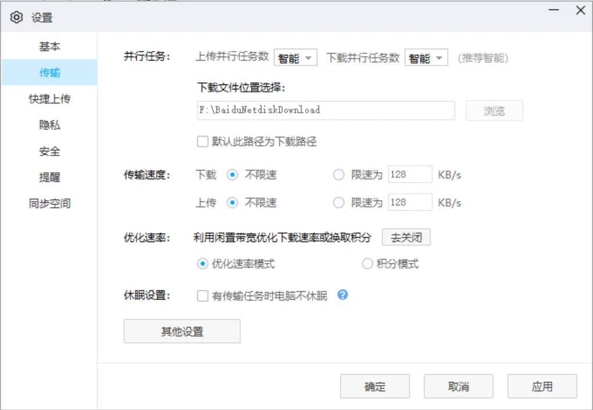
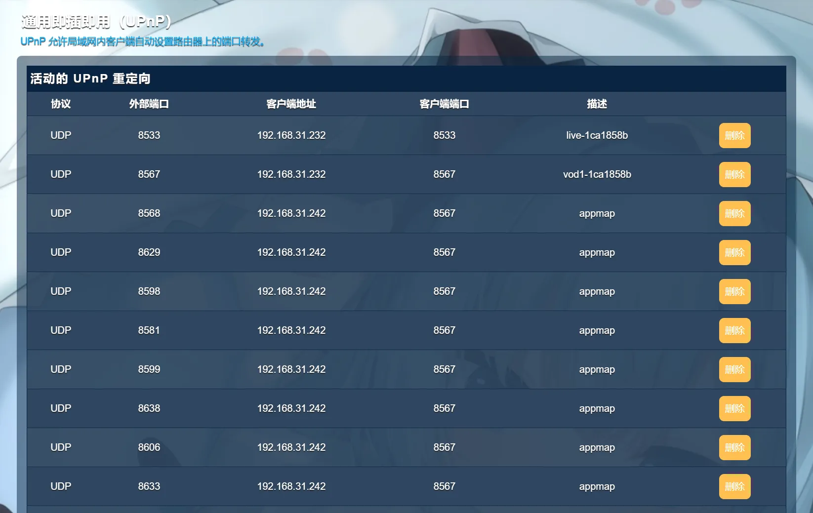
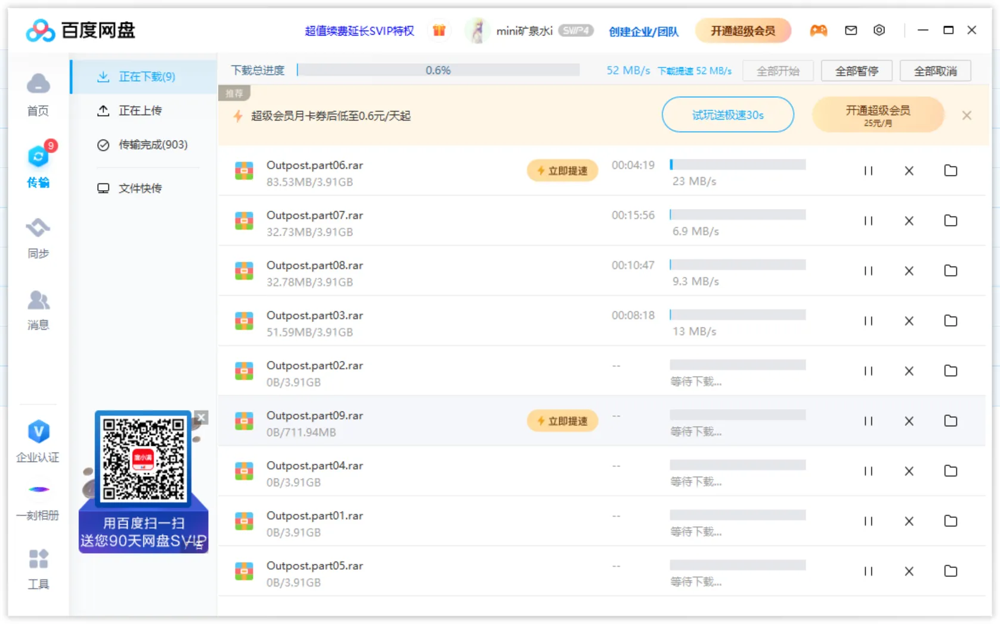

---
categories:
- 百度云盘
category: 百度云盘
draft: false
published: 2024-03-27 23:28:08
slug: 一个技巧解决百度云盘下载慢的问题
tags:
- baidu
- 百度
- 百度云盘
title: 一个技巧解决百度云盘下载慢的问题
updated: 2024-03-27 23:58:31
---

## 解决办法

~~开通百度云盘SVIP会员~~。

~~一定要开通SVIP~~

~~注意**SVIP**才是不限速下载，普通vip只有20G/月的高速下载流量，大一点的游戏都不够下。~~

## 解决办法二（电脑百度云盘）

打开百度网盘

进入设置

在左侧传输选项中，打开优化速率：

利用闲置宽带优化下载速率或换取积分（优化速率模式）

然后，最重要的一步来了

**必须打开路由器的upnp功能**！

**必须打开路由器的upnp功能**！

**必须打开路由器的upnp功能**！

这一步不能省略，不开会员不充值的情况下，靠百度云服务器传资源给你的流量是不可能大的，必须要走**p2p**下载才能拿到速度。

具体upnp打开方式请根据自己路由器自行搜索。

打开成功后将会看到活动转发。

然后下载时间段最好选择晚上，下午六点之后，网络高峰期，人最多，设备最多，此时p2p速度最快。

最后附上实际效果，该资源上传时间为8小时前，三百兆移动宽带：

愉快的玩耍吧