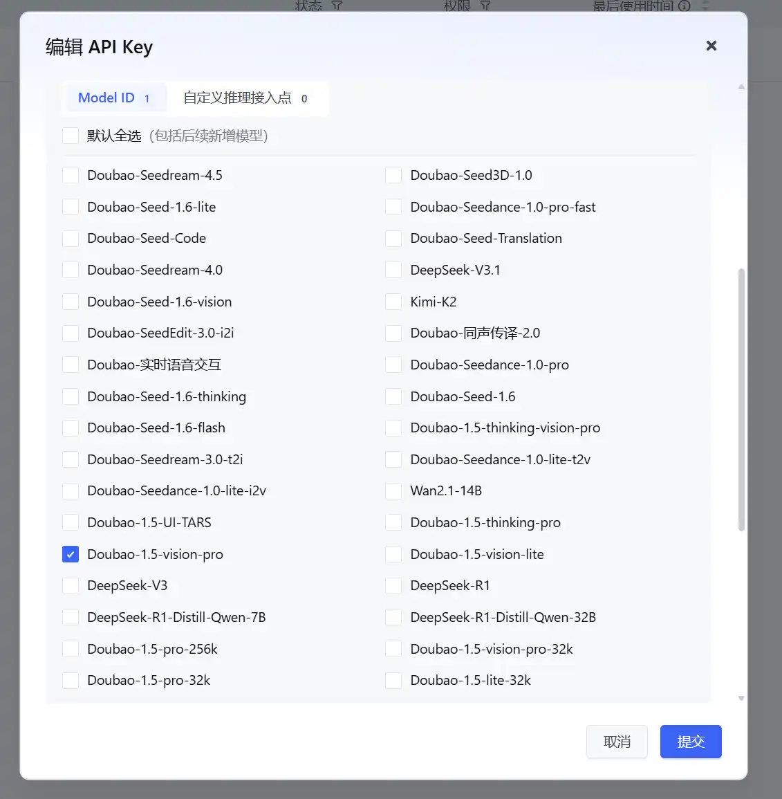
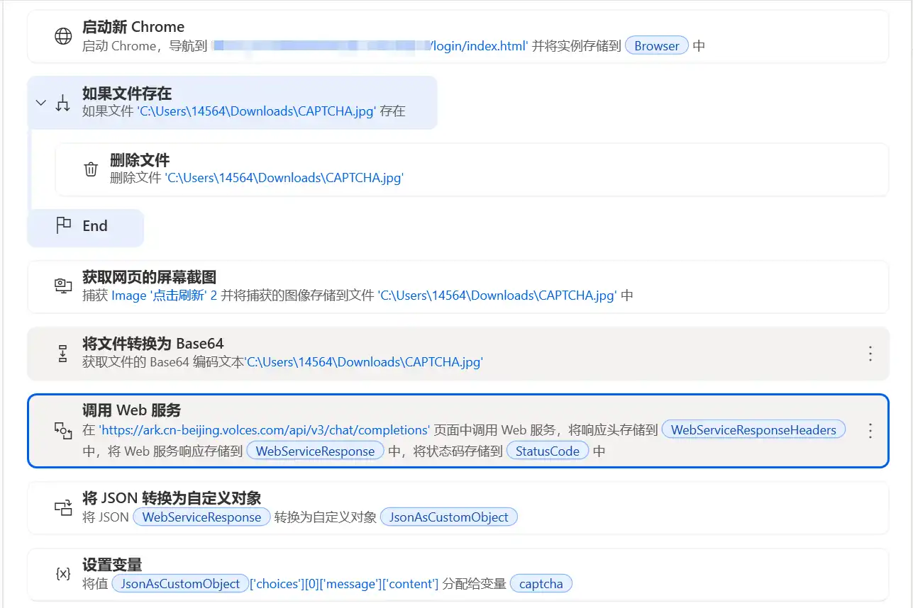
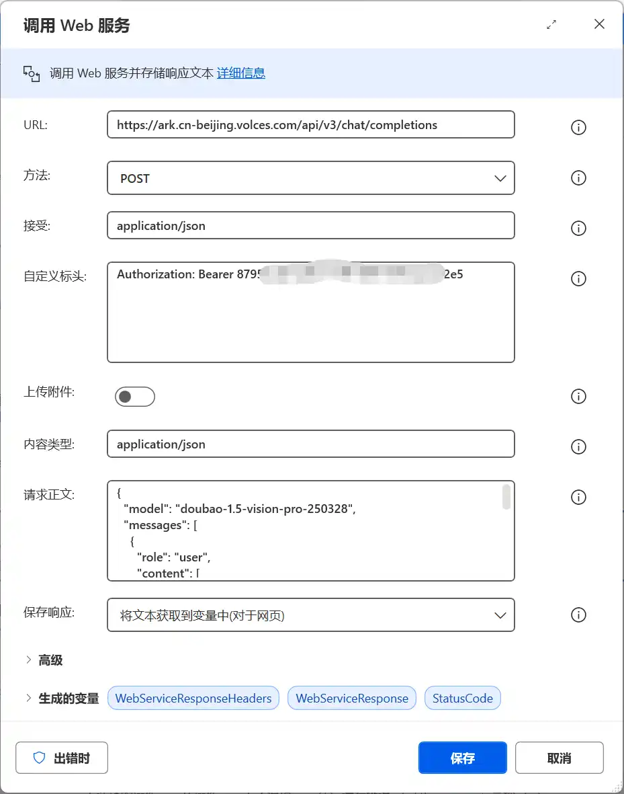
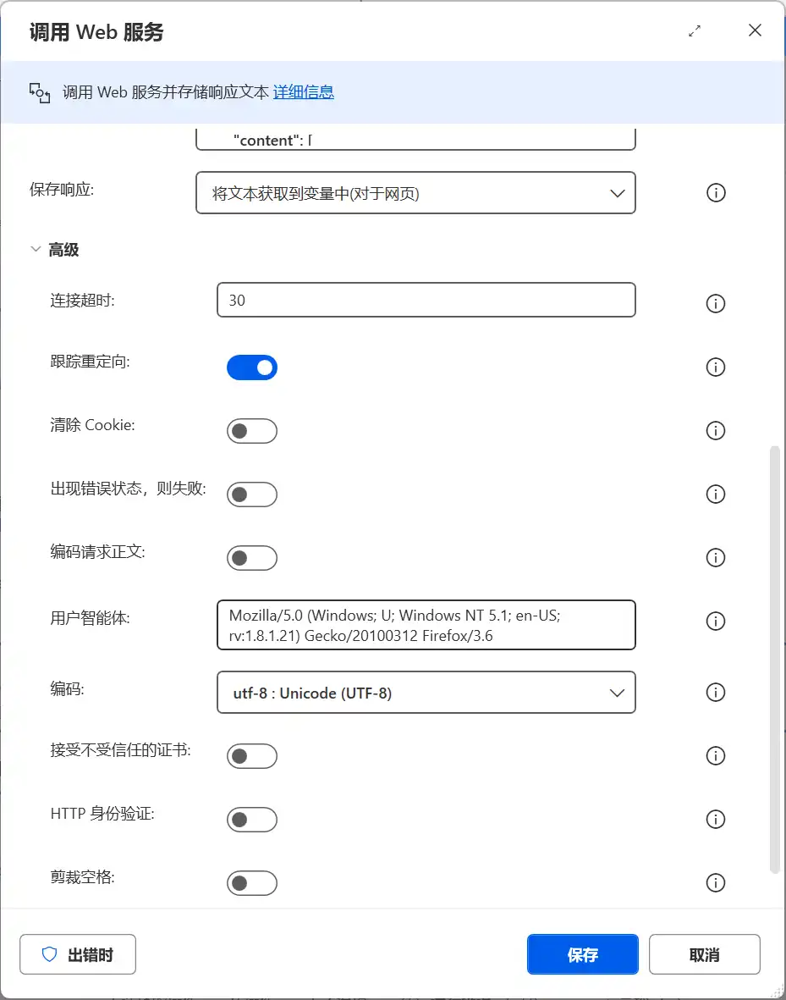
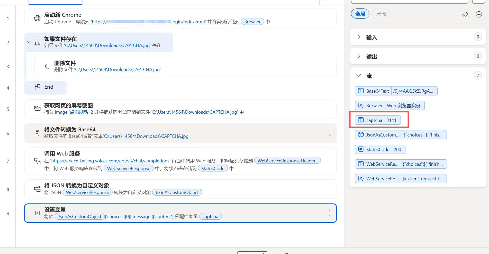

---
categories:
- AI
- LLM
- 信息技术
cover: ./权限.webp
date: 2025-12-04T20:08:40+08:00
draft: false
slug: 为-automate-自动化接入豆包ai-识别图形验证码
tags:
- Power Automate
- 图形验证码
- 登录验证码
- 自动工作流
title: 为 Automate 自动化接入豆包ai 识别图形验证码
updated: 2025-12-07T12:03:10+08:00
wp_id: 12466
---

最近帮朋友研究电脑自动执行工作流，让一些电脑上枯燥重复的手工作业流程实现全自动化。

开始就陷入一个误区，**想让ai操作电脑**。

> 以本地系统级Anget的 [OmniParser](https://github.com/microsoft/OmniParser) 为例，上手门槛很高，加ai操作不确定性太多，也需要高配算力来支撑图像识别，对于白领的普通办公电脑显然不现实。而第三方服务又有数据泄露隐患。

一段瞎折腾后发现，Windows11 自带的 [Power Automate](https://apps.microsoft.com/detail/9nftch6j7fhv?hl=zh-cn&gl=CN) 完全可以胜任。

Power Automate 允许通过模仿用户界面操作(例如单击和键盘输入)，在 Windows 桌面上实现网站和桌面应用程序自动化。

唯一美中不足的就是没办法识别图形验证码。

这次就利用豆包 ai 的接口来解决这个问题。

## 获取豆包API Key

注册登录字节AI大模型后台：<https://console.volcengine.com/auth/login>

创建API Key，权限全打开就行了，当然也可以只开放 Doubao-1.5-vision-pro

<https://console.volcengine.com/ark/region:ark+cn-beijing/apiKey?apikey=%7B%7D>



进入开通管理把模型全打开

<https://console.volcengine.com/ark/region:ark+cn-beijing/openManagement?LLM=%7B%7D&OpenModelVisible=false>

注新用户赠送50万tokens推理额度，加上**安心体验**，超出额度会自动断开。

对于只用来识别验证码足够了。

什么你问我额度用完怎么办？

> [网页版豆包](https://www.doubao.com/chat/)不是无限额度吗，直接让 Automate 自动打开网页去问豆包，无非更繁琐罢了。

## Power Automate 调用豆包

登录流程很简单

* 打开页面
* 判断登录
  + 需要登录
  + 填充账号和密码
  + 保存验证码图片到本地
  + 请求豆包api
  + 拿到内容填充验证码
* 业务操作
* 。。。

这次操作主要聚焦在登录图形码验证



重点在于调用web服务请求豆包

格式如下：

|  |  |
| --- | --- |
| URL | https://ark.cn-beijing.volces.com/api/v3/chat/completions |
| 方法 | POST |
| 接受 | application/json |
| 自定义标头 | Authorization: Bearer 这里填写豆包API Key |
| 内容类型 | application/json |

请求正文：

注意这里的 `%Base64Text%` 是上一步图片转成base64的变量，记得参照修改。

```
{
  "model": "doubao-1.5-vision-pro-250328",
  "messages": [
    {
      "role": "user",
      "content": [
        {
          "type": "text",
          "text": "识别这张图形验证码中的4个字符，仅返回纯字符（数字），忽略干扰线、噪点、旋转，按从左到右顺序返回，不要任何多余文字"
        },
        {
          "type": "image_url",
          "image_url": {
            "url": "data:image/png;base64,%Base64Text%"
          }
        }
      ]
    }
  ],
  "temperature": 0.0,
  "max_tokens": 10
}
```

完整截图：



这里有一个天坑，直接这样请求会返回：

```
{"code":"InvalidParameter","message":"we could not parse the JSON body of your request Request id: 0217648230058828cd1c854cd9412bce1ed325c44488d9efc4f58","param":"","type":"Bad Request"}}
```

原因在于 Power Automate 的 `调用Web服务` 默认会编码请求正文。

所以还需要点开 `高级` 进行修改：

把编码请求正文按钮关闭



拿到返回结果后，将返回的JSON转换为自定义对象

最后解析json拿到内容

```
%JsonAsCustomObject['choices'][0]['message']['content']%
```

## 效果




3141，目标达成！