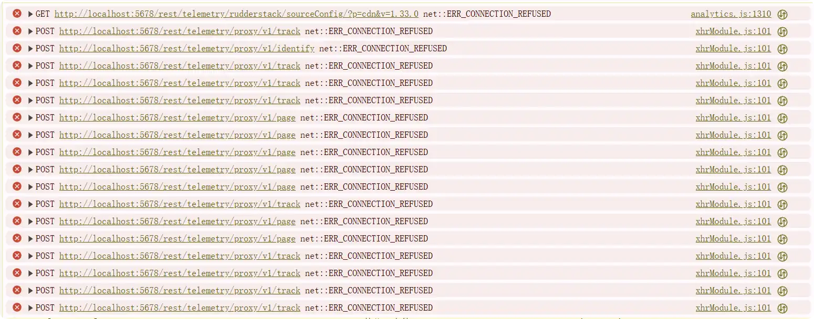

---
categories:
- 信息技术
- AI
- Agent
category: Agent
draft: false
published: 2025-12-14 12:40:06
slug: 关闭-n8n-的匿名遥测数据
tags:
- Docker
- docker-compose
- Agent
- n8n
- 遥测数据
title: 关闭 n8n 的匿名遥测数据
updated: 2025-12-15 14:22:48
---

最近升级了最新 n8n 2.0 版本，发现的匿名遥测数据似乎存在问题。

通过官方命令部署的n8n docker容器，遥测请求并不能访问正确网址，全部请求到了本地端口。

如果 n8n 在公网部署并且通过反向代理访问，可能会在浏览器控制台提示一堆错误，但也不影响使用。

```
analytics.js:1310 GET http://localhost:5678/rest/telemetry/rudderstack/sourceConfig/?p=cdn&v=1.33.0 net::ERR_CONNECTION_REFUSED   
xhrModule.js:101  POST http://localhost:5678/rest/telemetry/proxy/v1/track net::ERR_CONNECTION_REFUSED  
xhrModule.js:101  POST http://localhost:5678/rest/telemetry/proxy/v1/identify net::ERR_CONNECTION_REFUSED  
xhrModule.js:101  POST http://localhost:5678/rest/telemetry/proxy/v1/track net::ERR_CONNECTION_REFUSED  
xhrModule.js:101  POST http://localhost:5678/rest/telemetry/proxy/v1/track net::ERR_CONNECTION_REFUSED  
xhrModule.js:101  POST http://localhost:5678/rest/telemetry/proxy/v1/page net::ERR_CONNECTION_REFUSED
```



就像这样。

搜了一全，网上说配置 ~~N8N\_TELEMETRY\_ENABLED=false~~ 根本没用，甚至n8n文档都没这个环境变量，AI幻觉太严重了。

## 解决办法

办法有两种，一种是直接关闭遥测（推荐），另一种是配置主机名。

毕竟我都私有部署了，为什么还要发送自己数据呢。

### 关闭匿名遥测数据

添加 `N8N_DIAGNOSTICS_ENABLED = false` 环境变量。

> 注意：在[官方文档](https://docs.n8n.io/hosting/configuration/environment-variables/deployment/)中，禁用的匿名遥测数据同步禁用 Ask AI

docker

```
docker run -it --rm \
 --name n8n \
 -p 5678:5678 \
 -e N8N_DIAGNOSTICS_ENABLED="false" \
 docker.n8n.io/n8nio/n8n
```

docker compose

```
environment:
    N8N_DIAGNOSTICS_ENABLED: false
```

### 配置主机名字

添加 `N8N_HOST: 域名或IP` 环境变量。

docker

```
docker run -it --rm \
 --name n8n \
 -p 5678:5678 \
 -e N8N_HOST="www.krjojo.com" \
 docker.n8n.io/n8nio/n8n
```

docker compose

```
environment:
    N8N_HOST: www.krjojo.com
```