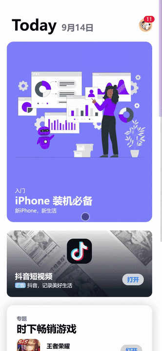

---
categories:
- 信息技术
- HTML
- css
category: css
draft: false
published: 2025-10-21 11:26:45
slug: 网页利用-view-transition-仿-appstore-转场动画
tags:
- HTML
- HTML5
- view-transition
- AppStore
title: 网页利用 view-transition 仿 AppStore 转场动画
updated: 2025-10-21 11:29:50
---

其实上个月为了体验这功能就做了这个demo项目，碍于后面有些事忙起来遗忘了，这次补发文章出来。

介绍一下 view-transition 背景，是 Web 开发中用于实现 DOM 元素过渡效果的技术，在24年中旬引入，现在各大主流浏览器也已经支持了，除了火狐（真的会有人用火狐吗）。

项目链接：<https://github.com/miniwater/AppStore>

示例：[miniwater.github.io/AppStore/](https://miniwater.github.io/AppStore/)

## 前进和后退

来看看效果

带有视差效果的前进和后退，与主流APP页面切换效果一致。


原理也很简单：

* 前进时：新页面从右侧进入，旧页面左滑一半退出
* 后退时：当前页右滑动退出，旧页面从左一半开始进入

知道了原理后就可以通过css transform: translateX(0); 对页面进行位移

```
/* 告诉浏览器开启支持view-transition */
@view-transition {
  navigation: auto;
}

@keyframes push-new {
  from {
    transform: translateX(100%); /* 从右侧屏幕外开始 */
  }
  to {
    transform: translateX(0); /* 移动到正常位置 */
  }
}

@keyframes push-old {
  from {
    transform: translateX(0); /* 从正常位置开始 */
  }
  to {
    transform: translateX(-50%); /* 滑出一半到左侧屏幕外 */
  }
}

/* 指定data-transition="push"页面才播放该动画，区分进入和推出动画 */
:root[data-transition="push"] {
  &::view-transition-old(root) {
    animation: push-old 0.5s ease-in-out; /* 旧页面 */
  }
  &::view-transition-new(root) {
    animation: push-new 0.5s ease-in-out; /* 新页面 */
  }
}

/* 下面是后退，与进入相反 */
@keyframes pop-new {
  from {
    transform: translateX(-50%);
  }
  to {
    transform: translateX(0);
  }
}

@keyframes pop-old {
  from {
    transform: translateX(0);
  }
  to {
    transform: translateX(100%);
  }
}

:root[data-transition="pop"] {
  &::view-transition-old(root) {
    animation: pop-old 0.5s ease-in-out;
    z-index: 999;
  }
  &::view-transition-new(root) {
    animation: pop-new 0.5s ease-in-out;
    z-index: 1;
  }
}
```

这时候动画效果已经写好了，

剩下只需要在js里判断什么时候用push，什么时候用pop就行了。

以进入为例，在进入的新页面中加入下面js

```
// 进入页面时触发
window.addEventListener("pagereveal", async (e) => {

  // 判断浏览器是否支持viewTransition
  if (e.viewTransition) {

    // 给 html 添加 data-transition="push"，以触发css动画
    document.documentElement.dataset.transition = "push";

    // 等待动画完成
    await e.viewTransition.finished;

    // 清理 data-transition
    delete document.documentElement.dataset.transition;
  }
});
```

只要进入该页面就会触发动画

那退出呢？

退出在上一层页面加入js，以首页为例

```
window.addEventListener("pagereveal", async (e) => {
  if (e.viewTransition) {
    document.documentElement.dataset.transition = "pop";
    await e.viewTransition.finished;
    delete document.documentElement.dataset.transition;
  }
});
```

此时就可以在html做出和app一样的前进后退效果了，

需要注意的是，在[官方案例](https://developer.chrome.com/docs/web-platform/view-transitions/cross-document?hl=zh-cn)当中，会使用到 `new URL(navigation.activation.from.url)` 和 `new URL(navigation.activation.entry.url)` 来获取上一层的url，来判断前进还是后退，但这个方法目前在苹果 safari 中不支持。

代替的解决办法是使用 sessionStorage 去记录当前页面的url，进入进页面时读取 sessionStorage 的 url 来对比判断当前是前进还是后退

## 展开和缩放

来看看效果

在很多APP都有相似的过渡动画，让元素从旧页面移动到新页面



> 这些动画其实有一个专门的描述词，叫做 **共享元素转场** (Shared Element Transition)， 或者叫做 **英雄动画** (Hero Animation)

实现方法是利用 viewTransitionName 声明两个页面拥有同一个元素

以a标签为例

```
<a href="./instal.html" id="instal" class="block bg-indigo-400">
  
  <div class="text-white px-5 pb-5">
    <p class="text-xs">入门</p>
    <p class="text-2xl font-semibold">iPhone 装机必备</p>
    <p class="text-xs">新iPhone，新生活</p>
  </div>
</a>

<script>
  // 跳转下一个页面前触发
  window.addEventListener("pageswap", async (e) => {
    if (e.viewTransition) {

      // 判断跳转的 url 是不是我们想要的
      const targetUrl = new URL(e.activation.entry.url);
      if (targetUrl.pathname.includes("instal")) {

        // 为转场元素设定viewTransitionName
        const instal = document.getElementById("instal");
        instal.style.viewTransitionName = "instal";
        
        // 结束后移除
        await e.viewTransition.finished;
        instal.style.viewTransitionName = "";
      }
    }
  });
</script>
```

与此同时，在新页面中也要设置 viewTransitionName

在单一动画场景中，我们可以直接在css 或者 style 中写死 viewTransitionName

```
<section class="bg-indigo-400" style="view-transition-name: instal">
  
  <div class="text-white px-5 pb-5">
    <p class="text-xs">入门</p>
    <p class="text-2xl font-semibold">iPhone 装机必备</p>
    <p class="text-xs">新iPhone，新生活</p>
  </div>
</section>
```

为什么强调只有单一动画场景才适合这样做呢，因为在触发单页动画时，拥有 viewTransitionName 的元素也会置顶做动画

## 番外

### 夜间模式切换


这个效果也是用 viewTransitionName 来实现的

原理也和上面大差不差，直接上代码了

```
@view-transition {
  navigation: auto;
}

@keyframes expand-out {
  from {
    clip-path: circle(0% at var(--x) var(--y));
  }
  to {
    clip-path: circle(100% at var(--x) var(--y));
  }
}

@keyframes contract-in {
  from {
    clip-path: circle(100% at var(--x) var(--y));
  }
  to {
    clip-path: circle(0% at var(--x) var(--y));
  }
}
.theme-transition::view-transition-old(root),
.theme-transition::view-transition-new(root) {
  animation: none;
  mix-blend-mode: normal;
}
.theme-transition.dark::view-transition-new(root) {
  animation: expand-out 0.5s ease-in;
}
html[data-theme="light"].theme-transition::view-transition-old(root) {
  animation: contract-in 0.5s ease-out;
  z-index: 2147483646;
}
html[data-theme="light"].theme-transition::view-transition-new(root) {
  z-index: 1;
}
```

需要event参数来获取鼠标点击位置

```
<button onclick="switchTheme(event)">
```

```
function switchTheme(event) {
  window.document.startViewTransition(() => {
    document.documentElement.style.setProperty("--x", event.clientX + "px");
    document.documentElement.style.setProperty("--y", event.clientY + "px");
    document.documentElement.classList.toggle("theme-transition", true);
    document.documentElement.classList.toggle("dark", isDark);
  });
}
```

只要举一反三，利用css，就能在新旧页面中玩出花来

## 总结

view-transition 很大程度降低了网页动画过渡开发难度。

它比起 [GSAP](https://gsap.com/) 、[animejs](https://animejs.com/) ，上手难度低，性能开销低，但带来可操作空间也低，只适合一些简单动画过渡。

目前只靠 view-transition 想实现 <https://animations.dev/> 所展示的动画效果也还远远不够。

了解技术优缺点，使用起来才能更得心应手。

## 参考文案

<https://developer.chrome.com/docs/web-platform/view-transitions/cross-document?hl=zh-cn>

<https://developer.mozilla.org/zh-CN/docs/Web/CSS/@view-transition>