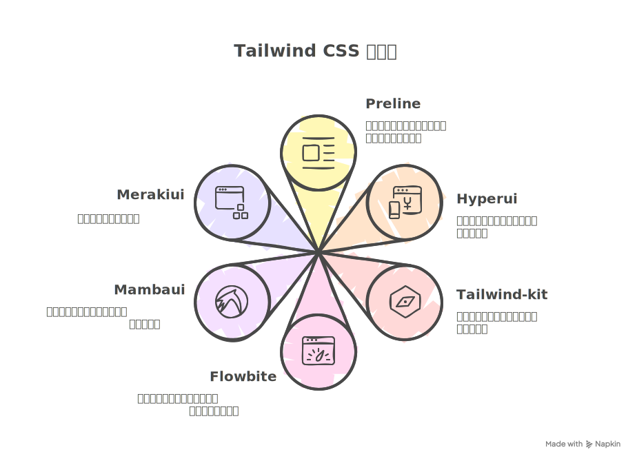

---
categories:
- css
- HTML
- 信息技术
cover: ./flowbite.avif
date: '2025-06-08T17:20:36+08:00'
draft: false
slug: 记录几个免费的-tailwindcss-组件库
tags:
- CSS
- Tailwind CSS
- UI
- UI kits
- 前端
- 组件库
title: 记录几个免费的 Tailwindcss 组件库
updated: '2025-06-20T22:09:48+08:00'
wp_id: 11289
---

在前端开发中，如果不想自己画组件，就只能使用组件库，单一组件库种类少，但是如果引用过多组件库，又会使得项目依赖繁重。

‌Tailwind CSS 则是一款功能类优先的原子化 CSS 框架‌，通过直接在 HTML 中组合高度可复用的工具类，快速构建定制化界面。

TailAwesome 是互联网上最好的 Tailwind 模板和 UI 套件的精选列表。

<https://www.tailawesome.com>

组件库可以在 UI kits 中找到。

如果想在线测试效果的话，可以把代码复制到 Tailwindcss 的 [Playground](https://play.tailwindcss.com/) 中查看。

## Preline

官网：<https://preline.co/>

组件库：<https://preline.co/examples.html>

虽然看起来需要额外安装它的组件库，但实际上只使用 examples 里面的样例的话，则并不需要。

## Hyperui

官网：<https://www.hyperui.dev/>

完全免费，不需要安装组件库，可以直接复制使用，种类非常丰富。

## Tailwind-kit

官网：<https://www.tailwind-kit.com/components>

完全免费，不需要安装组件库，可以直接复制使用，种类非常丰富。

## Flowbite

官网：<https://flowbite.com/>

组件库：<https://flowbite.com/blocks/>

不免费不开源，但是测试了一下，不安装也能使用，毕竟付费项目的审美还是在线的。

## Mambaui

官网：<https://mambaui.com/>

组件库：<https://mambaui.com/components>

免费、开源，数量不多，可以逛一逛。

## Merakiui

官网：<https://merakiui.com/>

组件库：<https://merakiui.com/components>

免费，不安装也能使用大部分组件。

## 更多

剩下的可以在 <https://www.tailawesome.com> 中查看。

太多容易选择困难症，这些足够应付了

