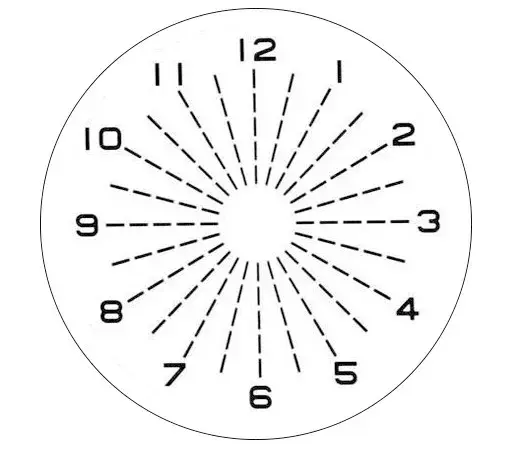

---
categories:
- 日记
- 生活
cover: ./新眼镜.avif
date: 2026-01-05T20:55:16+08:00
draft: false
slug: 上手：目村的五块钱眼镜
tags:
- 散光
- 眼镜
- 薅羊毛
- 近视
- 配眼镜
title: 上手：五块钱的目村眼镜
updated: 2026-01-06T20:00:14+08:00
wp_id: 12734
---

## 前因

上上周在抖音刷到了四块八配眼镜，价格给我惊呆了，门店正好在商业街附近，叫上近视的朋友一起探店。

四分之一奶茶钱

还包含验光

到了门店，在规定区域挑一副镜框，然后排队拿号验光就可以离开了，眼镜做好后微信会收到通知。

这个套餐的镜框都是没有鼻托的。（理论上可以拿自己旧眼镜的镜框去配，想起家里还有个钛金属镜框）

参与活动的人挺多，等眼镜做好已经是四天后了。

## 到手

全家福

一瓶未知成分的清洁剂，眼镜盒，眼镜布，眼镜本体

没有鼻托的眼镜

（其实还给了礼品袋装起来，懒得拍了）

## 测试

我是左平视，右50近视+50散光。

近视的自我检测

1. 近视眼患者看到的图是个戴眼镜，齐耳短发的女人。
2. 非近视眼患者看到的则只是竖条，视力好的还可以看出阴影。

散光的自我检测

1. 分别用左右裸眼观看上图；
2. 保持手机与眼睛同高，从远到近移动手机，直达刚好可以看清图中线条，保持此位置；
3. 双眼分别分辨图中虚线的粗细、深浅。

**分析：**

* 若看到所有虚线均匀分布，没有特别的深浅、长短之分，则基本没有散光现象；
* 若看到某条虚线特别黑亮，与其他虚线明显有区别，说明眼睛有一定程度散光，且改方向的位置则是被测者的**散光轴位**。

不放心，又尝试了一下[蔡司在线视力筛选检查](https://www.zeiss.com.cn/vision-care/eye-health-and-care/zeiss-online-vision-screening-check.html)。

近视的右眼一切正常，反而把平时的左眼轻微散光测出来了。

## 体验

这眼镜戴了两天，不知道是不是没习惯过来，还是说第一次戴厚边框的眼镜，还是说镜框太重没鼻托，戴久了会有一点酸胀感。

然后带起来会偏色，像是套了一层黄色滤镜，不过我看网上说老款防蓝光滤镜都会偏黄色，应该是正常吧。

看来五块钱的羊毛不好薅啊，又戴回旧眼镜了。