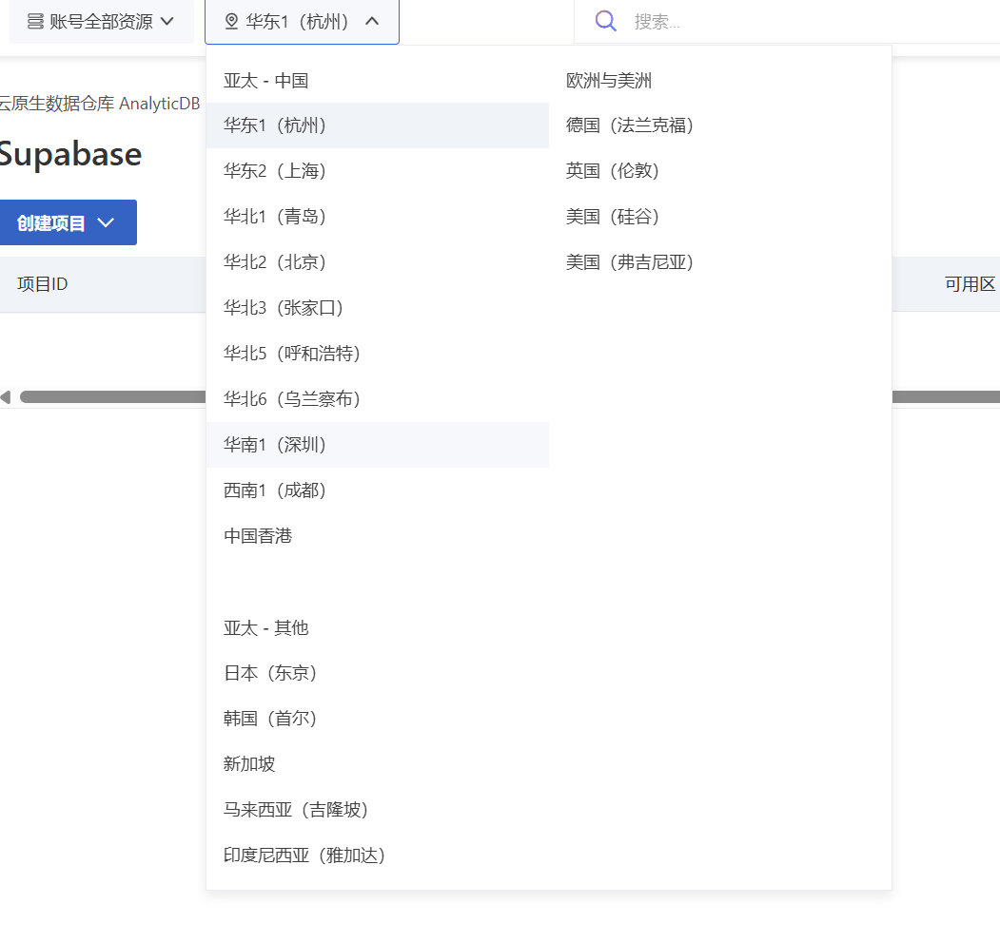
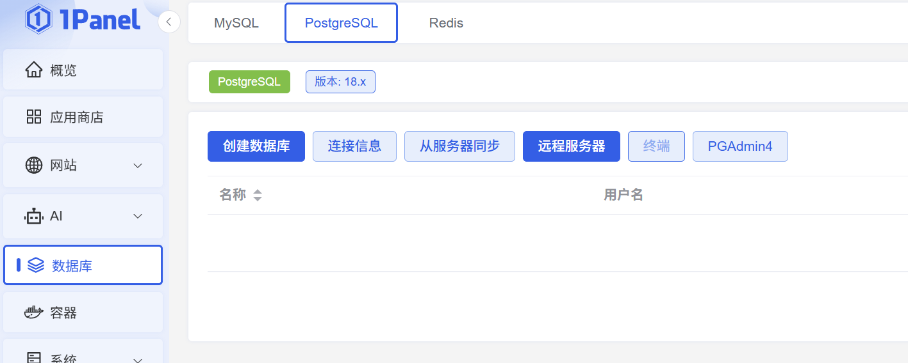
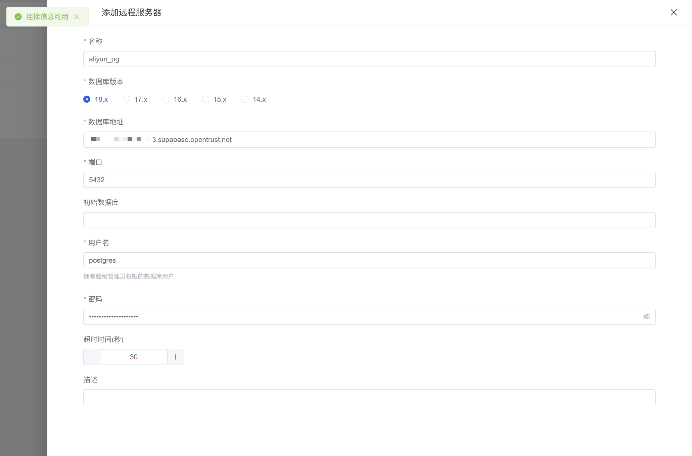

---
categories:
- 云服务
- 阿里云
cover: ./fIKXRGRXa.avif
date: 2026-01-13T15:35:54+08:00
draft: false
slug: 白嫖阿里云免费pg数据库
tags:
- PostgreSQL
- 免费
- 数据库
- 白嫖
- 阿里云
title: 白嫖阿里云免费PG数据库
updated: 2026-01-15T11:54:21+08:00
wp_id: 12765
---

去年年底，阿里云悄咪咪上线了一个 Supabase 平台，最吸引人的就是`阿里云原生数据仓库 AnalyticDB PostgreSQL版` 下多了免费的1核2G PostgreSQL 数据库。

当然，每人只能创建一台。


介绍也一如既往鸡贼，跟ESA免费版一样，注明了仅用于开发测试。信他就是对羊毛党的不尊重，薅它就完事了。


## 创建免费测试

打开：<https://gpdbnext.console.aliyun.com/gpdb/cn-hangzhou/supabase>


注意要选择地区，首批 Supabase PostgreSQL 支持的地区不全，比如就没有广州地区，无伤大雅，直接离服务器最近的。



一般来说，如果没有杭州地区的阿里云服务器，**专有网络**和**专有网络交换机**是空的，需要去[阿里云VPC控制台](https://vpc.console.aliyun.com/vpc/cn-hangzhou/vpcs)创建，要记住这里的**可用区**（杭州 可用区J）。


创建专有网络，可用区要与上方一样


回到创建项目，就可以看到专有网络存在了，ip白名单填写自己服务器IP。


如果服务器也是在同一个专有网络里，就可以走内网连接，速度非常块。

也可以不设白名单，直接0.0.0.0暴露公网，给其他不确定IP的服务使用，如Vercel、Dokploy...

## 1panel添加远程服务器





用户名默认是：postgres

数据库地址填外网连接地址，可以在阿里云Supabase PostgreSQL 基本信息里查看。

```
项目ID.supabase.opentrust.net
```


## 性能测试

毕竟是免费，公网连接，网络物理延迟是性能的瓶颈，Debuff叠满了，测试仅供图一乐。

* 测试软件：pgbench
* 连接方式：公网
* 地区：深圳->广州

### 标准压力测试

* 10 个并发连接
* 2 个线程
* 30 秒
* 5 秒 报告一次

```
pgbench -h spb-*.supabase.opentrust.net -p 5432 -U postgres -c 10 -j 2 -T 30 -P 5 test
Password:

pgbench (18.1, server 15.8)
starting vacuum...end.
progress: 5.0 s, 38.4 tps, lat 233.286 ms stddev 95.465, 0 failed
progress: 10.0 s, 42.2 tps, lat 236.762 ms stddev 56.552, 0 failed
progress: 15.0 s, 42.4 tps, lat 236.857 ms stddev 48.884, 0 failed
progress: 20.0 s, 42.4 tps, lat 235.358 ms stddev 52.196, 0 failed
progress: 25.0 s, 42.4 tps, lat 236.359 ms stddev 49.955, 0 failed
progress: 30.0 s, 42.4 tps, lat 235.453 ms stddev 41.865, 0 failed
transaction type: <builtin: TPC-B (sort of)>
scaling factor: 1
query mode: simple
number of clients: 10
number of threads: 2
maximum number of tries: 1
duration: 30 s
number of transactions actually processed: 1261
number of failed transactions: 0 (0.000%)
latency average = 235.723 ms
latency stddev = 59.334 ms
initial connection time = 398.050 ms
tps = 42.248489 (without initial connection time)
```

如果是公网链接，并不适合做读写频繁的业务，42 TPS拉到裤子里了。

### 只读模式

* 20 个并发连接
* 30 秒

```
pgbench -h spb-*.supabase.opentrust.net -p 5432 -U postgres -S -c 20 -T 30 test
Password:

pgbench (18.1, server 15.8)
starting vacuum...end.
transaction type: <builtin: select only>
scaling factor: 1
query mode: simple
number of clients: 20
number of threads: 1
maximum number of tries: 1
duration: 30 s
number of transactions actually processed: 51865
number of failed transactions: 0 (0.000%)
latency average = 10.917 ms
initial connection time = 1715.783 ms
tps = 1832.048180 (without initial connection time)
```

只读性能倒是非常优秀，适合SQL轻写入的项目。

## 总结

目前，该免费版本目前 **没有试用时长或次数限制** ，但阿里云保留未来调整免费策略的权利，并会通过公告等方式提前通知。

且用且珍惜吧。